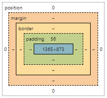

## 2022.08.30 WEB02


#### CSS 기본 스타일 - 사이즈

---

- **px(픽셀)**: 해상도의 한 화소 기준, 픽셀의 크기는 불변하며 고정적인 단위임
- **%**: 가변적인 레이아웃에 자주 사용
- **em**: 부모 요소에 대한 상속의 영향 받음, 상대적 사이즈
- **rem**: 부모 요소에 대한 상속 영향 X, 최상위 요소(html) 사이즈를 기준으로 배수 단위를 가짐

- **viewport**: 디바이스 기준으로 상대적인 사이즈가 결정됨
  - ✅세부적으로 개념을 파악하진 않고 존재가 있다는 정도로만 인지할 것


#### CSS 기본 스타일 - 그 외

---

- p { color: black }; - 폰트 색상
- 텍스트 서체, 자간, 배경 등은 MDN 문서를 참고할 것


#### CSS 적용 우선순위

---

- **!important** : 🚨사용 시 주의, 모든 우선순위를 다 망가뜨릴 수 있음. 가장 최 우선순위
  - 외부 라이브러리에서 많이 쓰는 패턴

- **우선순위**: 인라인 > id > class, 속성, pseudo-class > 요소, pseudo-element

* CSS 상속: 부모 요소의 속성을 자식에게 상속함
  - 상속되지 않는 속성도 존재


#### CSS 원칙

---

- 모든 요소는 네모(박스모델): 원도 정확히는 원이 아니라 네모에서 radius를 적용한 형태임.
- 위에서 아래로, 왼쪽에서 오른쪽으로 쌓인다
- Normal Flow
  - 한 줄에 쌓이는 배치: Inline Direction
  - 한 줄에 쌓인 모든 블록 형태의 배치: Block Direction

- margin, padding, border

  - margin은 공백, padding은 영역 내부, margin과 padding 사이는 border
  - margin-left, margin-right, margin-top, margin-bottom으로 상하좌우를 지정할 수도 있음

  


#### CSS Display

---

* block - 너비를 가질 수 없다면 자동으로 부여되는 margin
  - 줄바꿈이 일어나는 요소
  - margin 사용
  - 대표적인 예: div, ul, ol, li, p, hr 등
* inline - 컨텐츠 영역만큼임.
  - 줄바꿈이 일어나지 않는 요소
  - text align 사용
  - content 너비만큼 가로 폭을 차지함
  - 따라서 width, height, margin-top, margin-bottom 지정 불가
    생각해보면 당연한 것, 줄바꿈이 일어나지 않고 한 줄에 모든 것이 처리되기 때문에 상하 폭 필요X
  - 대표적인 예: span, a, img, input, label, b 등
* div 태그의 경우 옆 부분 모두를 보이지 않는 margin으로 채움. 따라서 div 뒤에 span이 와도 평행하게 있을 수 없음, div와 margin을 나란히 두고 싶으면 div class에서 display: inline-block으로 설정하여야 함
* align-center는 텍스트만 움직일 뿐 박스에 영향을 주지 않음. 텍스트 범위 내에서만 정렬하는 것임.


#### 예시 - 카드 만들기

---

```html
<html>
    <head>
        <title>Document</title>
        <style>
            .card {
                <!-- 영역잡기 어렵다면 border 지정 후 나중에 완성하고 border을 빼면 됨 -->
                border: 1px solid black; 
                width: 30rem;
                height: 60rem;
                <!-- 이미지를 중간에 배치하도록 card 영역에 설정 -->
                text-align: center;
            }
            .card-image {
                width: 100%;
                <!-- 여기서 margin을 줘버리면 컨텐츠 영역에서 image가 나가버림 -->
            }
            .profile {
                text-align: left;
            }
            .profile-image {
                width: 2rem;
                height: 2rem;
            }
        </style>
    </head>
    <body>
        <div class="card">
            <!-- card-image class로 컨텐츠 영역 안에 100% 차도록 설정 -->
            
            <h3> 일이 재미있도록! 데스크테리어 장인의 방</h3>
            <div class="profile">
                
                <span>포그니</span>
            </div>
        </div>
    </body>
</html>
```

