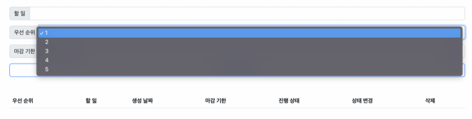

## 2022.09.29 Django Manual


#### ✏️가상환경 구조, 설치, DB 설계 및 migration

---

1. 가상환경 구조

   ```django
   ┌ server-venv (가상환경)
   └ todo (프로젝트)
     ├ todoapp (App)
     └ ...
   ```

   

2. 가상환경 생성

   ```python
   # 위치: server_day4
   $ python -m venv server-venv
   ```

   

3. 가상환경 실행

   ```python
   # 위치: server_day4
   $ . server-venv/Scripts/activate
   
   # 실행하면 하기와 같이 커맨드라인 위 (가상환경)으로 문자열 출력됨
   (server-venv)
   $
   ```

   

4. Django 설치

   ```python
   # 위치: server_day4
   (server-venv)
   $ pip install django=3.2.13
   
   # pip list로 Django 설치 내역 확인
   (server-venv)
   $ pip list
   
   Package    Version
   ---------- --------
   asgiref    3.5.2
   Django     3.2.13
   pip        22.0.4
   pytz       2022.2.1
   setuptools 58.1.0
   sqlparse   0.4.3
   ```

   

5. 프로젝트 생성

   ```python
   # 위치: server_day4
   (server-venv)
   $ django-admin startproject todo .
   ```

   

6. App 생성

   ```python
   # 위치: server_day4
   (server-venv)
   $ django-admin startapp todoapp
   ```

   

7. 서버 구동 테스트

   ```python
   # 위치: server_day4
   (server-venv)
   $ python manage.py runserver
   
   # 웹브라우저에서 localhost:8000/ 입력하여 django 초기 페이지가 출력되면 성공
   
   # python manage.py runserver 명령어가 너무 길면 shortcuts 활용
   # shortcuts 설정방법은 다음과 같음
   # 1) 패키지 설치
   (server-venv)
   $ pip install django-shortcuts
   
   # 2) django [shortcuts] 치면 바로 구동됨
   # shortcuts의 다른 단축명령어를 보려면 https://pypi.org/project/django-shortcuts/ 확인
   # 하기 명령어는 python manage.py runserver의 단축 명령어임
   (server-venv)
   $ django r
   
   # 참고) startapp을 하고 싶으면 하기와 같이 명령어 실행
   (server-venv)
   $ django sa
   ```

   

8. 생성한 APP 등록

   ```python
   # 위치: server_day4\todo\settings.py
   
   INSTALLED_APPS = [
       'todoapp',
       'django.contrib.admin',
       .....
   ]
   ```

   

9. 모델 생성: 데이터베이스 테이블의 스키마 정의

   생성해야 할 모델 필드 및 속성은 다음과 같음

   | 필드 이름  | 역할       | 필드    | 속성              |
   | ---------- | ---------- | ------- | ----------------- |
   | content    | 할 일 내용 | Char    | max_lenght=80     |
   | completed  | 완료 여부  | Boolean | default=False     |
   | priority   | 우선순위   | Integer | default=3         |
   | created_at | 생성 날짜  | Date    | auto_now_add=True |
   | deadline   | 마감 기한  | Date    | null=True         |

   

   ```python
   # 위치: server_day4\todoapp\models.py
   from django.db import models
   
   # Create your models here.
   # 아규먼트 models.Model은 import한 models 모듈의 Model을 상속받아 구성됨
   class todoapp(models.Model):
       
       # DB 정의
       # 필드 = models.어떤 타입의 필드인지(기본값)
       # 기본값을 설정하지 않을 경우 django에서 자동으로 값을 설정함
       content = models.CharField(max_length=80)
       completed = models.BooleanField(default=False)
       priority = models.IntegerField(default=3)
       created_at = models.DateField(auto_now_add=True)
       deadline = models.DateField(null=True)
   ```

   

10. DB migration 생성 (migration: 한 운영환경으로부터 다른 운영환경으로 옮기는 작업)

   - migration 작업 후 server_day4\todoapp\migrations\0001_initial.py 생성되었는지 확인
   - 파이썬으로 작성된 DB 설계도가 생성되었음!

   ```python
   # 위치: server_day4
   (server-venv)
   $ python manage.py makemigrations
   
   # 또는 shortcuts를 이용
   (server-venv)
   $ django mm
   
   Migrations for 'todoapp':
     todoapp\migrations\0001_initial.py
       - Create model todoapp
   (server-venv) 
   ```

   

11. migrate 작업 수행

    - 9번에서 생성한 설계도를 실제 데이터베이스에 반영하는 과정
    - 해당 작업을 거치면 db.sqlite3 파일에 반영됨

    ```python
    # 위치: server_day4
    (server-venv)
    $ python manage.py migrate
    
    # 또는 shortcuts를 이용
    (server-venv)
    $ django m
    
    ....
    Applying sessions.0001_initial... OK
    Applying todoapp.0001_initial... OK
    ....
    ```

    

12. todoapp의 templates 정의 및 index 페이지 생성

    ```html
    # 위치: server_day4\todoapp
    # 1) 폴더 templates 생성하고, 생성한 templates 폴더 하위에 다시 todoapp 폴더 생성
    # 2) server_day4\todoapp\templates\todoapp 내에 index.html 생성
    
    # server_day4\todoapp\templates\todoapp\index.html
    <!DOCTYPE html>
    <html lang="en">
    
    <head>
      <meta charset="UTF-8">
      <meta http-equiv="X-UA-Compatible" content="IE=edge">
      <meta name="viewport" content="width=device-width, initial-scale=1.0">
      <title>Document</title>
    </head>
    
    <body>
      <h1>todoapp index 페이지 테스트</h1>
    </body>
    
    </html>
    ```

    

13. 다중 app 실행을 위해 URL 분리: todoapp의 urls.py 생성

    ```python
    # 위치: server_day4\todoapp\urls.py
    
    # urls 패키지 내의 path 모듈 가져옴
    from django.urls import path
    # 현재 디렉토리에서 views 모듈 가져옴
    from . import views
    
    # 루트 페이지 URL 등록
    urlpatterns = [
        path("", views.index, name="index"),
    ]
    ```

    

14. todo 프로젝트에 생성한 todoapp의 urls.py 인식하도록 설정

    ```python
    # 위치: server_day4\todo\urls.py
    from django.contrib import admin
    from django.urls import path, include # 수정: include 추가
    
    urlpatterns = [
        path("admin/", admin.site.urls),
        path("", include("todoapp.urls")),
    ]
    ```

    

15. 생성한 index.html이 루트 페이지로 제대로 동작하는지 테스트

    ```python
    # 위치: server_day4
    (server-venv)
    $ django r
    
    # 웹브라우저 주소창에 localhost:8000 입력하여 생성했던 index.html 내용이 나오는지 확인
    ```

    

16. 재사용성을 위한 base.html 생성

    ```html
    # 위치: server_day4
    # templates 폴더 생성, server_day4\templates\ 에 base.html 생성
    
    # 최종 위치: server_day4\base.html
    <!DOCTYPE html>
    <html lang="en">
    
    <head>
      <meta charset="UTF-8">
      <meta http-equiv="X-UA-Compatible" content="IE=edge">
      <meta name="viewport" content="width=device-width, initial-scale=1.0">
      <title>Document</title>
      <!-- CSS Bootstrap -->
      <link href="https://cdn.jsdelivr.net/npm/bootstrap@5.2.1/dist/css/bootstrap.min.css" rel="stylesheet"
        integrity="sha384-iYQeCzEYFbKjA/T2uDLTpkwGzCiq6soy8tYaI1GyVh/UjpbCx/TYkiZhlZB6+fzT" crossorigin="anonymous">
    </head>
    
    <body>
      <!-- JS Bootstrap -->
      <script src="https://cdn.jsdelivr.net/npm/bootstrap@5.2.1/dist/js/bootstrap.bundle.min.js"
        integrity="sha384-u1OknCvxWvY5kfmNBILK2hRnQC3Pr17a+RTT6rIHI7NnikvbZlHgTPOOmMi466C8" crossorigin="anonymous">
        </script>
    
      
      
    </body>
    
    </html>
    ```

    

17. base.html 인식을 위한 BASE_DIR 설정

    ```python
    # 위치: server_day4\todo\settings.py
    ...
    # 하기 경로는 수정하지 않음, django에서 설정한 기본값 그대로 가져감
    # 하기 경로는 프로젝트의 최상단 폴더를 가리킨다고 이해하고 넘어감
    BASE_DIR = Path(__file__).resolve().parent.parent
    ...
    
    # "DIRS":[] -> "DIRS":[BASE_DIR / "templates"],으로 수정
    TEMPLATES = [
        {
            "BACKEND": "django.template.backends.django.DjangoTemplates",
            "DIRS": [BASE_DIR / "templates"], # [] -> [BASE_DIR / "templates"],으로 수정
            "APP_DIRS": True,
            "OPTIONS": {
                "context_processors": [
                    "django.template.context_processors.debug",
                    "django.template.context_processors.request",
                    "django.contrib.auth.context_processors.auth",
                    "django.contrib.messages.context_processors.messages",
                ],
            },
        },
    ]
    ```

    

18. index.html에 base.html 확장하여 base.html 값을 가져오도록 설정

    ```html
    # 위치: server_day4\templates\todoapp\index.html
    
    
    
    
    <h1>todoapp index 페이지 테스트</h1>
    
    ```

    

19. 정상 구동되는지 확인

    ```python
    # 위치: server_day4
    (server-venv)
    $ django r
    
    # 웹브라우저 주소창에 localhost:8000 입력하여 생성했던 index.html 내용이 나오는지 확인
    ```

    

20. (선택) 설치한 pip 패키지 버전 저장

    ```python
    $ pip freeze > requirements.txt
    
    (참고)
    * bash terminal에서 vi로 열람 가능
    ```


---


#### ✏️루트 페이지 생성

---

1. 가상환경 구조 + HTML

   ```django
   ┌ server-venv (가상환경)
   └ todo (프로젝트)
     ├ todoapp (App)
       ├ index.html (root page)
   
     └ ...
   ```

   

2. 개발 요구사항

   ---

   

   

   

   - 할 일 추가 폼 <form>

     - 할 일: <input type="text"> 태그 활용, 최대 입력 길이 80
     - 우선 순위: <select>, <option> / 참고자료 https://thrillfighter.tistory.com/572
     - 마감기한: <input type="date">

     

   

   - 할 일 목록 <table>
     - <thead>: 우선순위, 할 일 내용, 생성 날짜, 마감 기한, 진행 상태, 상태 변경, 삭제
     - <tbody>: id를 기준으로 오름차순으로 정렬한 모든 데이터 화면에 표시
     - 변경: 할 일의 상태(True/False) 가 수정
     - 삭제: 버튼을 누르면 해당 할 일이 삭제됨

   ---

   

3. 요구사항을 반영한 index.html 생성 - 겉표면만 생성한 상태

   - Input 값을 받아오는 태그는 name으로 DB와 통신하므로 name 지정하여야 함

   ```html
   
   
   <div class="container-fluid">
     <!-- 마감기한 달력에서 default값 오늘 날짜로 설정-->
     <script type="text/javascript">
       window.onload = function () {
         today = new Date();
         console.log("today.toISOString() >>>" + today.toISOString());
         today = today.toISOString().slice(0, 10);
         console.log("today >>>> " + today);
         bir = document.getElementById("now_date");
         bir.value = today;
       }
     </script>
   
     <h1 class="mt-5 mb-5 text-center"><strong>TODO LIST APPS</strong></h1>
     <!-- 할일 추가 폼 -->
     <form>
       <!-- 할 일 -->
       <div class="input-group mb-3">
         <span class="input-group-text" id="todowork">할 일</span>
         <input type="text" class="form-control">
       </div>
   
       <!-- 우선순위 select 선택 -->
       <div class="input-group mb-3">
         <span class="input-group-text" id="priority">우선순위</span>
         <select class="form-select bg-secondary" style="--bs-bg-opacity: .3;">
           <option selected></option>
           <option value="1">1</option>
           <option value="2">2</option>
           <option value="3">3</option>
           <option value="4">4</option>
           <option value="5">5</option>
         </select>
       </div>
   
       <!-- 마감기한 달력에서 선택 -->
       <div class="input-group mb-3">
         <span class="input-group-text" name="enddate">마감 기한</span>
         <input type="date" id="now_date" class="form-control">
       </div>
         
       <!-- [할 일 추가] 버튼 -->
       <div class=" d-grid gap-2">
         <input type="submit" class="btn btn-outline-primary" value="할 일 추가">
       </div>
     </form>
   
     <!-- 할 일 목록 테이블 -->
     <div>
       <table class="table mt-5">
         <thead>
           <tr>
             <th scope="col">우선 순위</th>
             <th scope="col">할 일 내용</th>
             <th scope="col">생성 날짜</th>
             <th scope="col">마감 기한</th>
             <th scope="col">진행 상태</th>
             <th scope="col">상태 변경</th>
             <th scope="col">삭제</th>
           </tr>
         </thead>
         <tbody>
           <tr>
             <!-- 하기 th, td 내용은 CRUD 작업을 거쳐서 변경될 예정 -->
             <th scope="row">1</th>
             <td>내용</td>
             <td>생성 날짜-오늘날짜 출력</td>
             <td>마감기한은 위에서 선택한 날짜</td>
             <td>진행 상태 출력</td>
             <td>
               <div class="form-check form-switch">
                 <input class="form-check-input" type="checkbox" role="switch" id="switch" checked>
                 <label class="form-check-label" for="switch">변경</label>
               </div>
             </td>
             <td>할일 삭제</td>
           </tr>
         </tbody>
       </table>
     </div>
   
   </div>
   
   ```


#### ✏️ Create: 할 일, 우선순위, 마감기한을 입력받아 table에 출력

---

- 1] urls.py, 2] views.py, 3] html 파일 수정하여야 함

- [할 일 추가] 버튼을 누르면 입력값이 하단 테이블에 기록되어야 함 - redirect 이용

  
