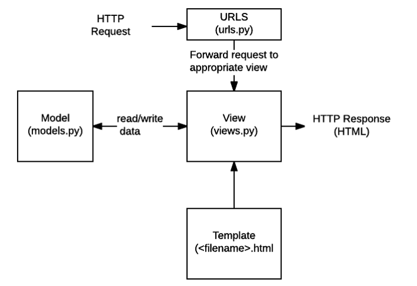

## 2022.10.25 Django14 - 팔로우 기능 구현


### 📌복습

---

- DB 모델 관계에 따른 쿼리셋

```text
- A.B_set.all() : A(1):B(N)

- C.Ds.all(): C(M):D(N)

- e.f.all(): E(N):F(1)
  - 다중참조시 naming을 복수형(s)으로 작성하고, 단일 참조시 단수형으로 naming 하는 것이 암묵적인 룰
```


- get VS filter

```text
get: 쿼리에 맞는 객체 하나([0]번째)만 반환
filter: 쿼리에 맞는 쿼리셋을 반환
```


- CRUD

```text
save(): DB에 실제 저장되는 방식
delete(): DB에서 삭제
```


### 📌 M:N (user:user) 모델을 이용한 팔로우 기능 구현

---

```python
# models.py 예시
...
class User(AbstractUser):
    # self가 들어가는 이유는 팔로우는 user:user로 이루어지는 구조이기 때문
    # ManyToManyField에서 self가 사용될 때에만 symmentrical 옵션이 사용됨.
    followings = models.ManyToManyField('self', symmentrical=False, related_name='followers')
```


- symmentrical 옵션의 사용법

  - 팔로잉: symmentrical = False
    - user A가 다른 user B의 게시글을 구독함
    - B 입장에서는 팔로워로 A가 등록됨

  - 싸이월드의 경우 일촌을 서로 맺어야 일촌이됨: symmentrical = True

- 팔로잉 기능 구현

  - 사용자 프로필에 들어가서 팔로우를 누르면 추가 (add)
  - 팔로우 상태이면 ''팔로우 취소'' 버튼을 누르면 삭제 (remove)
  - URL: `accounts/<int:user_pk>/follow`
  - 처리 완료되면 사용자 페이지로 redirect
  - (추가사항) 셀프 팔로우는 허용할 수 없음

```python
# accounts/urls.py
...
url_patterns = [
    path('<int:user_pk>/follow/', views.follow, name='follow'),
]
```


```python
# accounts/views.py
...
# add - 로그인한 유저가 프로필의 유저의 팔로워에 추가
def follow(request, pk):
    # user 쿼리셋 가져오기
    User = get_user_model()
    user = User.objects.get(pk=pk)
    
    # 요청한 유저가 프로필의 유저와 동일하다면 detail 페이지로 redirect
    if request.user == user:
        messages.warning('accounts:detail', pk)
        return redirect('accounts:detail', pk)
    
    # 프로필 유저의 팔로워들에 요청한 유저가 있는지 확인 
    if request.user in user.followers.all():
        user.followers.add(request.user)
    return redirect('accounts:detail', pk)
```


```html
<!-- accounts/templates/accounts/detail.html -->
...
<p>
    팔로우: {{ user.followings.count }} |  팔로워: {{ user.followers.count }}
</p>

<!-- 팔로우 요청한 유저가 프로필의 유저가 아니라면 팔로우 취소/팔로우 버튼 출력 -->

<a href=>
    
    	팔로우 취소
    
    	팔로우
    
</a>

...
```


### 📌 view decorators & functions

---

- Q) views.py는 html을 반환할까?
  - A) html을 응답하는것이 아닌 response 객체를 응답하는 것!
  - https://developer.mozilla.org/en-US/docs/Learn/Server-side/Django/Introduction
  - 하기의 그림을 보면 결국은 view는 model을 참조하고 template를 참조해서 사용자로부터 요청되어온 request를 받아 response를 응답해주는 구조임. 
  - 


- 이제까지 views.py에서 return 값으로 render와 request를 응답했다면, 다른 구조도 존재함.

  - render: status code 2xx 해당
  - redirect: status code 3xx 해당
    - @login_required: status code 200에 해당하는 것을 확인할 수 있음
    - redirect는 GET 요청만 가능함. 즉, URL만 리다이렉트 해주지 데이터 자체를 전달하진 않음.
  - 페이지가 없는데 URL로 강제 호출하면 404 Page not found를 확인할 수 있음
  - 500번대 에러 출력은? 서버에서 오타를 내거나 하는 등 서버 설정에러. Internal server error
  - 500번 에러 출력을 방지하기 위해 django는 shortcut으로 만들어둠
    (https://docs.djangoproject.com/en/4.1/topics/http/shortcuts/)
  - 하기 코드를 사용하고 예를 들어 100번 게시글 까지만 있는 게시판에 500번 게시글을 요청하면,
    500번 에러를 출력하는 것이 아닌 404 Page not found를 출력해줌.
    - 이는 서버의 설정을 노출하지 않기 위한 방법인듯 함.
    - Article.objects.get(pk=pk)처럼 get으로 데이터 가져오는 구문을 get_object_or_404(Article, pk=pk)처럼 변경해주면 됨!

  ```python
  # views.py
  
  ...
  from django.shortcuts import render, redirect, get_object_or_404
  ...
  
  def detail(request, pk):
      ...
      article = get_object_or_404(Article, pk=pk)
  ```

  


- @require_POST 데코레이터

  - "페이지가 작동하지 않습니다"로 에러 메시지를 완화시켜줌

  ```python
  # views.py
  
  ...
  from django.views.decorators.http import require_POST
  ...
  
  @require_POST
  ```

- @require_GET, @require_safe 등의 데코레이터도 존재!


### 💡활용하기 유용한 사이트

---

- POSTMAN: https://www.postman.com/


⭐ Javascript를 이용한 로또 생성 프로그램 코드를 숙지하고 올 것.
